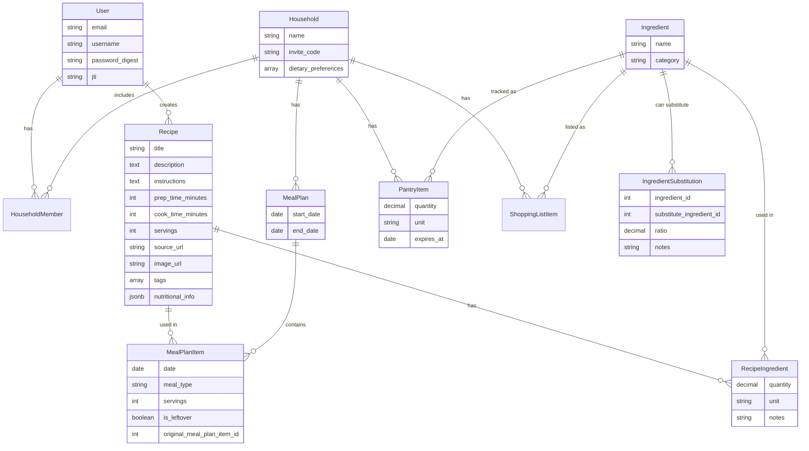

# Application Documentation

## Overview
Recipe Box is a comprehensive application for managing personal recipes, household meal planning, and grocery shopping. It allows users to digitize their recipes, plan meals for their household, and automatically generate shopping lists.

## Entity Relationship Diagram (ERD)

## Core Features

### 1. Recipe Management
- **Create/Edit**: Manual entry of recipes with structured ingredients and instructions.
- **Import from URL**: Automatically extract recipe details from external websites.
- **Quick Text Import**: Paste ingredient lists and have them automatically parsed.
- **Nutrition Tracking**: Enter or auto-estimate calories, protein, carbs, and fat per serving.
- **Dietary Tags**: Recipes are automatically tagged (Vegetarian, Vegan, Dairy-Free) based on ingredients.
- **Search & Filter**: Find recipes by name, ingredient, tag, or pantry availability.

### 2. Household Management
- **Households**: Users can create or join a household using an invite code.
- **Collaboration**: All household members share access to meal plans, pantry, and shopping lists.
- **Dietary Preferences**: Set household dietary rules (Vegetarian, Gluten-Free, etc.) for recipe warnings.

### 3. Meal Planning
- **Weekly Planner**: Visual calendar interface to plan meals for the week.
- **Drag & Drop**: Easily move recipes between days and meal slots.
- **AI Generation**: Auto-generate a week's meals based on preferences with one click.
- **Leftovers**: Schedule leftover meals linked to the original cooking session.
- **Scaling**: Adjust serving sizes for specific meals.

### 4. Shopping List & Pantry
- **Auto-Generation**: Generate shopping lists based on the week's meal plan.
- **Smart Aggregation**: Combines quantities of the same ingredient across recipes.
- **Aisle Sorting**: Items grouped by category (Produce, Dairy, Meat, etc.) for efficient shopping.
- **Amazon Links**: Quick search links to find ingredients on Amazon.
- **Pantry Tracking**: Track availability of ingredients at home.
- **Expiration Tracking**: Visual warnings for expired or expiring items.

### 5. Cooking Experience
- **Cook Mode**: Full-screen, distraction-free cooking view with:
  - Wake Lock (prevents screen sleep)
  - Step-by-step navigation with swipe gestures
  - Automatic time detection in instructions
  - Built-in countdown timers
- **Smart Substitutions**: View alternative ingredients (e.g., replace buttermilk with milk + lemon juice).
- **Dietary Warnings**: Alerts when a recipe conflicts with household preferences.

### 6. Analytics & Stats
- **Cooking Dashboard**: Track meals cooked, favorite recipes, and total cooking time.
- **Recipe Popularity**: See which recipes are cooked most often.
### 7. Household Roles & Permissions
- **Head Chef**: The household admin. Full control over settings, member management, and invite codes. Access to the Admin Dashboard.
- **Sous Chef**: Can manage recipes, meal plans, and pantry. Cannot manage household members.
- **Line Cook**: Read-only access. Can use Cook Mode and view recipes but cannot make changes.

### 8. Admin Dashboard (Head Chef Only)
- **Overview Stats**: View total members, recipe counts, and membership breakdown.
- **User Management**: View all household members, change their roles (promote/demote), or remove them.
- **Role Distribution**: Visual breakdown of roles within the household.

### 9. Account Management
- **Password Reset**: Secure email-based password reset flow.
  - Forgot Password link on login screen.
  - Email with secure, time-limited reset token.
  - Frontend form to set a new password.

## Key Workflows

### 1. Recipe Import Workflow
1. User enters a recipe URL in the "Import" field.
2. Backend `RecipeImportService` fetches the HTML and parses structured data (JSON-LD preferred).
3. Ingredients are intelligently parsed into quantity, unit, and name.
4. Dietary tags are automatically assigned based on ingredient categories.
5. User reviews the imported data in the `RecipeEditor`.
6. User can add nutrition info manually or use "Auto-Estimate".
7. User saves the recipe, adding it to their collection.

### 2. Quick Text Import (Alternative to OCR)
1. User clicks "Paste from Clipboard" in the Recipe Editor ingredients section.
2. User pastes a list of ingredients (one per line, e.g., "1 cup flour").
3. System parses each line into structured data (quantity, unit, name).
4. Parsed ingredients are added to the recipe.

### 3. Meal Planning Workflow
1. User navigates to the Meal Planner for a specific week.
2. User can manually add recipes or use "AI Generate" for automatic planning.
3. For manual: User selects a day and meal type, then picks a recipe.
4. For AI: System generates meals respecting dietary preferences and time limits.
5. User generates a shopping list from the plan.

### 4. Cooking Session Workflow
1. User views a recipe and clicks "Start Cooking".
2. Cook Mode activates with full-screen step-by-step view.
3. User navigates through steps using arrows or swipe gestures.
4. Detected times in instructions can be started as countdown timers.
5. When finished, the session is logged for analytics.

### 5. Shopping Workflow
1. User generates shopping list from meal plan.
2. Items are grouped by aisle (Produce, Dairy, etc.).
3. User checks off items as they shop.
4. For hard-to-find items, user can click Amazon link to search online.
5. Purchased items can be added to pantry.

### 6. Dietary Safety Workflow
1. User sets dietary preferences in Settings (Vegetarian, Gluten-Free, etc.).
2. When viewing a recipe, the system compares recipe tags against preferences.
3. If a conflict is detected, a warning banner is displayed.
4. User can still proceed but is informed of the conflict.

## Feature Availability Matrix

| Feature | Status | Notes |
|---------|--------|-------|
| Recipe CRUD | ✅ Complete | Full create, read, update, delete |
| URL Import | ✅ Complete | Supports JSON-LD and meta tags |
| Quick Text Import | ✅ Complete | Parse ingredient lists from clipboard |
| Meal Planning | ✅ Complete | Weekly view with drag & drop |
| AI Meal Generation | ✅ Complete | Respects preferences and time limits |
| Shopping List | ✅ Complete | Auto-generate with aisle sorting |
| Pantry Tracking | ✅ Complete | With expiration warnings |
| Cook Mode | ✅ Complete | Full-screen with timers |
| Smart Substitutions | ✅ Complete | Database of common substitutions |
| Leftovers | ✅ Complete | Link to original meals |
| Dietary Tags | ✅ Complete | Auto-tag based on ingredients |
| Dietary Warnings | ✅ Complete | Per-household preferences |
| Nutrition Input | ✅ Complete | Manual entry + mock estimate |
| Cooking Analytics | ✅ Complete | Dashboard with stats |
| Amazon Links | ✅ Complete | Quick search from shopping list |
| Price Estimation | ⏳ Planned | Requires external price API |
| Password Reset | ✅ Complete | Email-based secure reset flow |
| Role Management | ✅ Complete | Head Chef/Sous Chef/Line Cook roles |
| Admin Dashboard | ✅ Complete | Household stats and member management |
